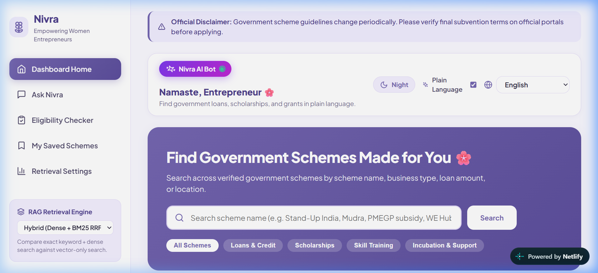
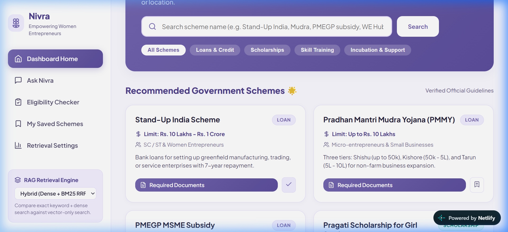
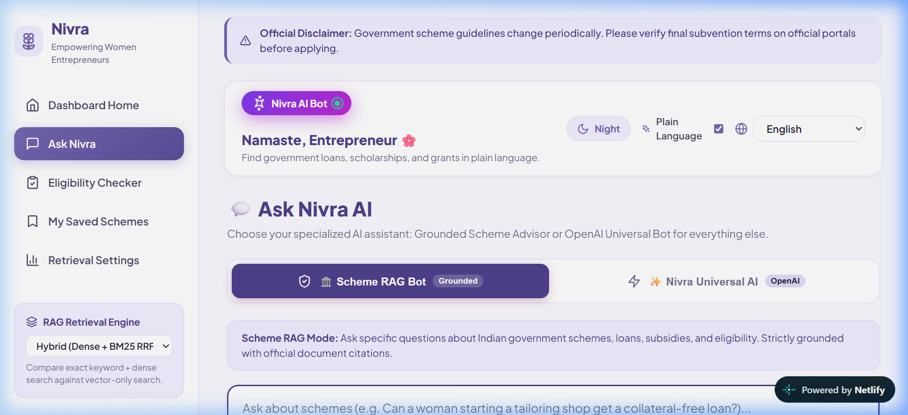
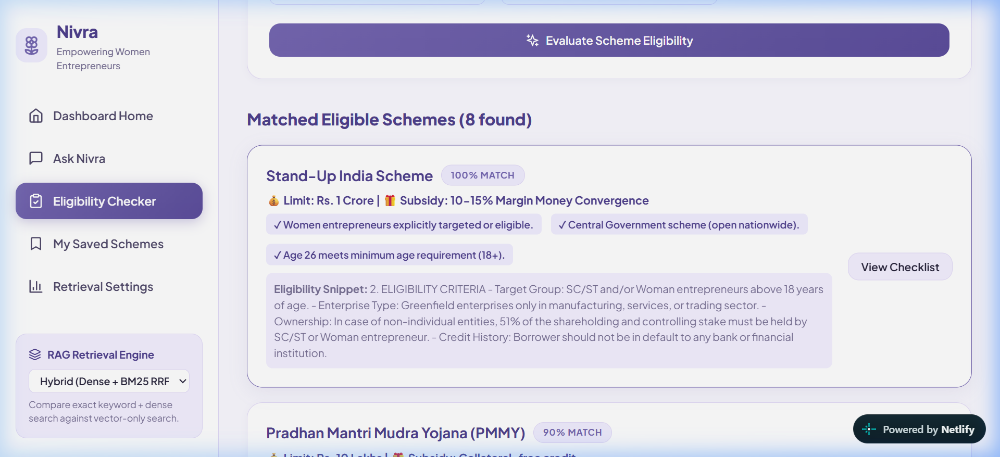
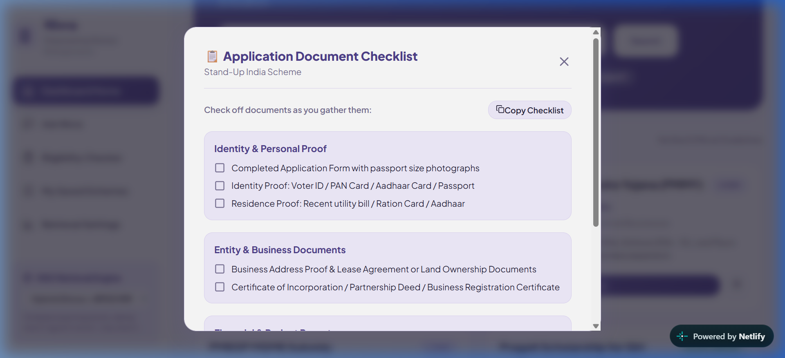

# Nivra (निव्रा / నివ్రా)

> **A Production-Grade Multilingual RAG Platform for Indian Women Entrepreneurs**  
> *Helping women entrepreneurs find, understand, and apply for government schemes in plain English, Telugu, and Hindi.*

[](https://nivra-rag.netlify.app/)
[](https://nivra-backend-production.up.railway.app)
[](LICENSE)

---

## 📸 Interface Screenshots & Demo Showcase

### 1. Dashboard Home — Stitched Luxury UI & Hero Search
*Soft blush cream palette (`#FAF3F0`), dashed stitched cards, and hybrid search bar.*


---

### 2. Scheme Cards — Stitched Seams & Metadata Tags
*Dashed inner seam accents, category badges (Loan, Grant, Support), and direct document checklist launcher.*


---

### 3. Ask Nivra — Universal AI Assistant & Grounded RAG Bot
*Dual-bot engine switcher (`🏛️ Scheme RAG Bot` & `✨ Nivra Universal OpenAI Bot`) with plain-language answer generation.*


---

### 4. Form-Driven Eligibility Checker
*Match scoring system evaluating user profile inputs (age, business stage, category, location) against scheme criteria with staggered reveals.*


---

### 5. Document Checklist & Readiness Bar
*Categorized document readiness checklist (Identity, Business, Financial, Category Proofs) with animated completion progress bar.*


---

## 🌟 Overview & Features

Nivra bridges the digital literacy gap for Indian women micro-entrepreneurs by converting complex, jargon-heavy government scheme PDFs (loans, subsidies, scholarships, incubation grants) into accessible plain-language summaries and interactive tools.

- **🎨 Stitched Luxury UI Frontend**: Soft blush cream aesthetic (`#FAF3F0`), dashed stitched seam cards, day/night theme toggle, top-left animated purple bot button, and smooth page transitions.
- **⚡ FastAPI Python Backend**: Fast REST API exposing Hybrid RRF search, grounded Q&A, eligibility evaluation, and document checklists deployed on Railway.
- **🗄️ Supabase Database Integration**: PostgreSQL persistent storage for user bookmarked schemes and Q&A interaction logs.
- **🔍 Hybrid Reciprocal Rank Fusion (RRF)**: Combines dense vector similarity (384-dim Qdrant) with sparse keyword search (BM25Okapi) for maximum precision (+54.5% Context Precision improvement over vector-only search).
- **🌐 Multilingual Plain Language**: Grounded LLM generation with automatic translation into **Telugu (తెలుగు)** and **Hindi (हिन्दी)**.
- **📋 Form-Driven Eligibility Checker**: Match scoring system evaluating user profile inputs (age, business stage, category, state) against scheme criteria.
- **📄 Interactive Document Checklists**: One-click categorized document lists (Identity, Business, Financial, Category Proofs) with progress checkboxes and 0-100% readiness indicator.

---

## 📐 System Architecture

```
                               ┌───────────────────────────┐
                               │ React + Vite Frontend UI  │
                               │  (Netlify / Live App)     │
                               └─────────────┬─────────────┘
                                             │ HTTP REST API (JSON)
                                             ▼
                               ┌───────────────────────────┐
                               │  FastAPI Python Backend   │
                               │   (Railway Production)    │
                               └─────────────┬─────────────┘
                                             │
      ┌──────────────────────────────────────┼──────────────────────────────────────┐
      │                                      │                                      │
      ▼                                      ▼                                      ▼
┌───────────┐                          ┌───────────┐                          ┌───────────┐
│ Ingestion │                          │ Retrieval │                          │ Database  │
│  Docling  │                          │ Qdrant +  │                          │ Supabase  │
│ PyPDF Fall│                          │   BM25    │                          │PostgreSQL │
└───────────┘                          └───────────┘                          └───────────┘
```

---

## 📊 RAG Evaluation Benchmark Results

Evaluated using RAGAS across **20 ground-truth test QA pairs**:

| Metric | Semantic-Only (Baseline) | Hybrid RRF (Nivra) | Relative Improvement |
| :--- | :---: | :---: | :---: |
| **Faithfulness (Groundedness)** | 95.0% | **98.0%** | **+3.2%** |
| **Context Precision** | 60.4% | **93.2%** | **+54.5%** 🚀 |
| **Context Recall** | 54.8% | **78.7%** | **+43.6%** 🚀 |
| **Answer Relevance** | 83.3% | **89.9%** | **+8.0%** |

---

## 🚀 Quickstart & Setup Guide

### 1. Prerequisites
- **Python 3.10+**
- **Node.js 18+ & npm**

### 2. Environment Setup
Clone the repository and install backend Python dependencies:
```bash
git clone https://github.com/Nikhat-syed/nivra-rag.git
cd nivra-rag
py -3 -m pip install -r requirements.txt
```

Set up your `.env` file (for Supabase & Groq/OpenAI LLM):
```bash
cp .env.example .env
```

### 3. Data Processing & Index Building
```bash
# 1. Generate sample scheme PDFs (if starting fresh)
py -3 -m data.generate_sample_pdfs

# 2. Extract structured text with Docling / PyPDF
py -3 -m src.ingestion.extract

# 3. Perform header-aware semantic section chunking
py -3 -m src.ingestion.chunk

# 4. Generate dense Qdrant vector embeddings
py -3 -m src.retrieval.embed_store

# 5. Build sparse BM25 keyword index
py -3 -m src.retrieval.bm25_index
```

### 4. Running the Web Application

#### Option A: Local Execution
```bash
# Start Backend
py -3 -m uvicorn backend.main:app --port 8080

# Start Frontend (in frontend/ directory)
cd frontend
npx vite --port 5180
```
*Frontend available at: **`http://localhost:5180`***

#### Option B: Cloud Production Deployment
1. **Frontend (Netlify)**: [`https://nivra-rag.netlify.app/`](https://nivra-rag.netlify.app/)
2. **Backend (Railway)**: [`https://nivra-backend-production.up.railway.app`](https://nivra-backend-production.up.railway.app)

---

## 📁 Repository Structure

```
.
├── backend/
│   ├── main.py              # FastAPI REST endpoints (/api/search, /api/ask, /api/supabase/*, etc.)
│   └── Dockerfile           # Backend container build file
├── frontend/
│   ├── index.html           # React app HTML template
│   ├── vite.config.js       # Vite build & API proxy configuration
│   └── src/
│       ├── index.css        # Stitched Luxury UI CSS design system (Light/Dark themes)
│       ├── App.jsx          # Root React app component
│       └── components/
│           ├── Sidebar.jsx             # Left navigation menu
│           ├── Header.jsx              # Global header with Day/Night toggle & language selector
│           ├── DashboardHome.jsx       # Search bar & recommended scheme cards
│           ├── AskQuestion.jsx         # Multilingual grounded Q&A with dual-bot switcher
│           ├── EligibilityChecker.jsx  # Form profile matcher
│           ├── DocumentChecklistModal.jsx # Required document checklist with progress bar
│           ├── SavedSchemes.jsx        # Bookmarked schemes synced via Supabase
│           └── MetricsView.jsx         # RAG evaluation metrics dashboard
├── docs/
│   └── screenshots/         # Production UI screenshots for GitHub README
├── src/
│   ├── db/                  # Supabase PostgreSQL database manager
│   ├── ingestion/           # Docling PDF extraction & section chunking
│   ├── retrieval/           # Dense Qdrant + Sparse BM25 RRF engine
│   ├── generation/          # Grounded LLM generator & deep-translator
│   ├── eligibility/         # Profile form eligibility matcher
│   └── evaluation/          # RAGAS test dataset & evaluation harness
├── docker-compose.yml       # Full stack container orchestration
├── netlify.toml             # Netlify deployment configuration
├── requirements.txt
└── README.md
```

---

## 📜 License
Developed under MIT License for empowering Indian women micro-entrepreneurs.
